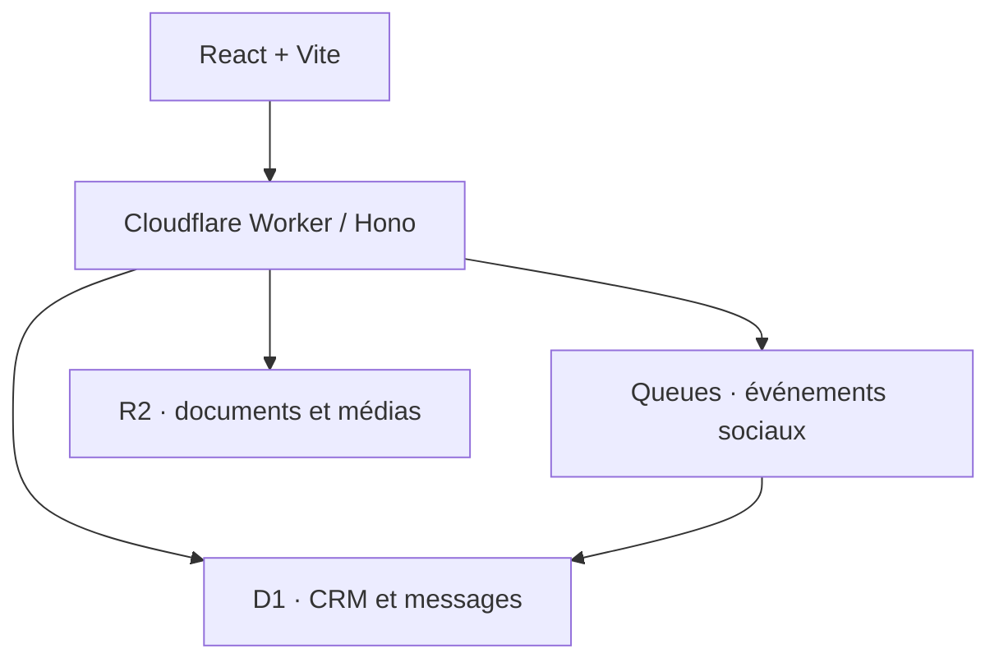

# Neptune Social Conversion

MVP interface-first pour transformer les commentaires et messages sociaux en conversations, leads et revenu attribué.

Le projet réunit le frontend React et l’API dans un seul Cloudflare Worker. Il démarre en mode démonstration sans clé externe, puis bascule progressivement vers les API Instagram, YouTube et TikTok.

**Démonstration Cloudflare :** https://neptune-social-conversion.neptunebusinessclub.workers.dev

## Ce qui fonctionne déjà

- tableau de bord et entonnoir social → client ;
- cinq connexions sociales avec capacités réellement disponibles ou bloquées ;
- inbox unifiée, filtres, brouillon IA et envoi simulé ;
- automatisations activables et assistant de création en quatre étapes ;
- pipeline CRM manipulable et fiche opportunité ;
- analyses par canal et paramètres de gouvernance IA ;
- API Worker, webhook Meta signé, Queue asynchrone et persistance D1 idempotente ;
- tests dans le runtime Workers, build Vite et dry-run Wrangler.

## Architecture minimale



Un seul dépôt, un seul déploiement et aucun serveur à maintenir. Cloudflare Access doit protéger l’interface interne en production.

## Démarrage local

Prérequis : Node.js 22 ou plus récent.

```bash
npm ci
cp .dev.vars.example .dev.vars
npm run cf-typegen
npm run db:migrate:local
npm run dev
```

L’application est immédiatement utilisable avec `DEMO_MODE=true`. Les secrets d’exemple ne sont pas requis tant qu’aucun webhook réel n’est appelé.

Pour travailler uniquement sur l’interface, sans émuler le Worker, utiliser `npm run dev:ui`. Le frontend retombera automatiquement sur les données de démonstration.

## Vérification

```bash
npm run typecheck
npm test
npm run build
npm run cf:check
```

## Déploiement Cloudflare

Le chemin le plus rapide est la Git integration de Cloudflare Workers : connecter ce dépôt, utiliser `npm run build` comme commande de build et `npx wrangler deploy` comme commande de déploiement.

Une action GitHub manuelle est aussi fournie. Ajouter les secrets de dépôt `CLOUDFLARE_API_TOKEN` et `CLOUDFLARE_ACCOUNT_ID`, puis lancer le workflow **Deploy Cloudflare**.

Les ressources D1, R2 et Queue sont déclarées par nom dans `wrangler.jsonc` et peuvent être provisionnées automatiquement au premier déploiement. Les migrations D1 sont ensuite appliquées par le workflow.

Configurer les secrets applicatifs sans les committer :

```bash
npx wrangler secret put META_APP_SECRET
npx wrangler secret put META_VERIFY_TOKEN
npx wrangler secret put OPENAI_API_KEY
npx wrangler secret put YOUTUBE_API_KEY
npx wrangler secret put TIKTOK_CLIENT_SECRET
```

Maintenir `DEMO_MODE=true` jusqu’à la validation des apps développeur, des webhooks et d’un premier compte pilote. Passer ensuite la variable à `false` dans `wrangler.jsonc`.

## Documents produit

- [Spécification interface et backend](docs/product-spec.md)
- [Schéma D1 initial](migrations/0001_initial.sql)

## Limites assumées du MVP

- Instagram : les DM et réponses privées dépendent des permissions Meta et de l’App Review.
- YouTube : commentaires et réponses publiques uniquement, pas de DM.
- TikTok : Business Messaging reste masqué tant que l’accès partenaire n’est pas accordé.
- « Nouveau follower → DM » est présenté comme capacité indisponible, jamais comme promesse produit.

Ces limites sont encodées dans les objets `capabilities` afin que le backend et l’interface partagent la même source de vérité.
