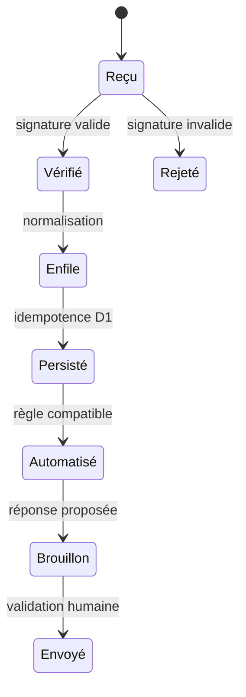

# Spécification produit — Neptune Social Conversion

## Principe directeur

Chaque écran correspond à un agrégat backend clair. Une action visible doit avoir un endpoint, une permission et un résultat traçable. Une fonctionnalité refusée par une plateforme n’apparaît pas comme activable.

## Carte interface → backend

| Écran | Question utilisateur | Lecture | Mutation | Stockage / traitement |
|---|---|---|---|---|
| Vue d’ensemble | « Qu’est-ce que le social rapporte ? » | `GET /api/bootstrap` puis agrégats dédiés en live | Changement de période | D1, agrégation quotidienne |
| Connexions | « Quels comptes fonctionnent vraiment ? » | comptes, état OAuth, capacités | connecter, resynchroniser, révoquer | secrets Cloudflare + `social_connections` |
| Inbox | « À qui répondre maintenant ? » | conversations, messages, intention, priorité | envoyer, assigner, changer d’étape | D1 + API sociale + Queue |
| Automatisations | « Quel signal déclenche quelle action ? » | règles, exécutions, taux de succès | créer, tester, activer | D1 + Queue + journal d’audit |
| Pipeline CRM | « Où en est chaque opportunité ? » | contacts, valeur, étape | déplacer, qualifier, gagner | D1 |
| Analyses | « Quel canal convertit ? » | funnel, source, revenu attribué | période, export | D1 + CSV généré par Worker |
| Paramètres IA | « Que peut suggérer le copilote ? » | ton, règles, connaissances | enregistrer, importer | D1 + R2 + AI Gateway |

## Inbox : structure exacte

La vue desktop a trois zones :

1. liste filtrable des conversations avec canal, compte, non-lus et priorité ;
2. fil de messages avec brouillon IA et compositeur ;
3. fiche contact avec intention, sentiment, valeur et étape CRM.

Sur mobile, la liste puis le fil s’empilent. La fiche contact devient un panneau secondaire dans une prochaine itération. L’envoi IA reste en mode brouillon : le collaborateur confirme toujours l’envoi pendant le MVP.

## Modèle d’événement

La clé externe de l’événement est unique dans `webhook_events`. Un retry Queue ne crée donc ni message ni lead en double.

## Matrice de capacités

| Capacité | Instagram pro | YouTube | TikTok |
|---|---:|---:|---:|
| Lire les commentaires | Oui, après permissions | Oui | Selon app approuvée |
| Répondre aux commentaires | Oui | Oui, publiquement | Selon app approuvée |
| Lire / répondre aux DM | Oui, après App Review | Non | Accès Business Messaging requis |
| Réponse privée depuis un commentaire | Selon permission Meta | Non | Non par défaut |
| Nouveau follower → message | Capacité expérimentale, masquée par défaut | Non | Non |

Le backend fournit cette matrice par connexion. Le frontend ne déduit jamais une capacité à partir du seul nom de la plateforme.

## Données minimales

- `workspaces` : séparation future des clubs ou agences ;
- `social_connections` : compte externe, état et capacités ;
- `contacts` : identité unifiée par plateforme ;
- `conversations` et `messages` : inbox et historique ;
- `automation_rules` et `automation_runs` : configuration et preuve d’exécution ;
- `webhook_events` : idempotence et diagnostic ;
- `audit_logs` : action humaine ou automatique.

Les tables et index sont créés dans `migrations/0001_initial.sql`.

## Ordre de connexion recommandé

1. Déployer l’interface en mode démo et la protéger avec Cloudflare Access.
2. Connecter un seul compte Instagram professionnel pilote.
3. Recevoir les webhooks signés, puis activer la lecture seule.
4. Autoriser les réponses manuelles depuis l’inbox.
5. Activer les brouillons IA, toujours avec validation humaine.
6. Ajouter YouTube pour les commentaires.
7. Ajouter TikTok uniquement après confirmation écrite des capacités accordées.

## Définition d’un MVP opérationnel

- un compte Instagram pilote reçoit commentaires et DM sans doublon ;
- un collaborateur répond depuis l’inbox ;
- la conversation crée ou actualise un lead ;
- une règle simple crée un brouillon testable ;
- le dashboard affiche des métriques issues de D1 ;
- chaque échec est visible dans les logs structurés Cloudflare ;
- aucune clé API n’existe dans GitHub.
